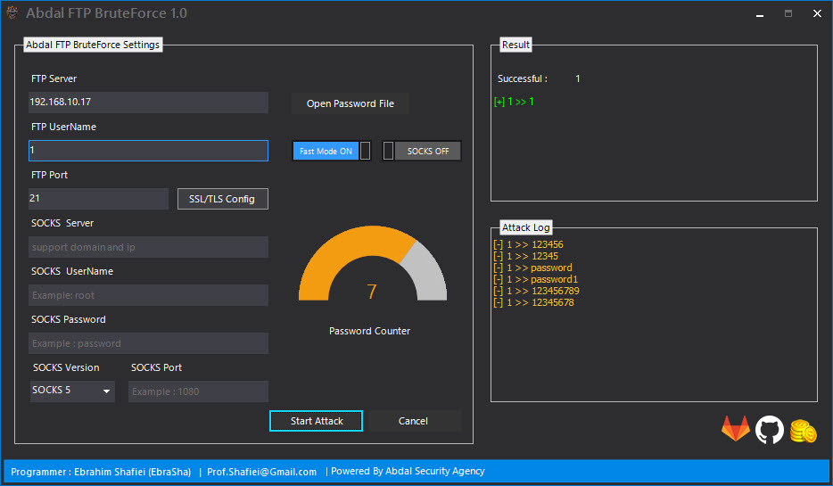

# Abdal FTP BruteForce

## Screenshot

## Made For 

Abdal FTP BruteForce tool is a powerful software with a zero error rate designed to test the security of servers using the FTP protocol. This tool supports proxy usage for attacks and can redirect all your traffic through the proxy during the hacking process.

**Requires**
> Visual Studio 2019 - Telerik WinForm - Chilkat - .NetFramework 4.*
>

Features

- Fast Mode
- Support implicit SSL connection
- Support TLS
- Support TLS 1.3
- Real Reaction
- Zero Fault
- Proxy Attack Support
- Beautiful appearance
- Has an installation package
- No malware
- Open Source
- Very high speed

## Donation 
> Donate link: https://donate.abdalagency.ir/ 

## Reporting Issues

If you are facing a configuration issue or something is not working as you expected to be, please use the **Abdal.Group@Gmail.Com** or **Prof.Shafiei@Gmail.com** . Issues on GitLab are also welcomed.

### About Programmer
Ebrahim Shafiei (EbraSha) (Ready to cooperate with international projects)
  - Email : Prof.Shafiei@Gmail.com

## License
Abdal Map Tracker is open-source software licensed under the [MIT license.](https://choosealicense.com/licenses/mit/)

## ⚠️ Legal disclaimer ⚠️

Usage of Abdal FTP BruteForce for Spying targets without prior mutual consent is illegal. It's the end user's responsibility to obey all applicable local, state and federal laws. Developers assume no liability and are not responsible for any misuse or damage caused by this program.

